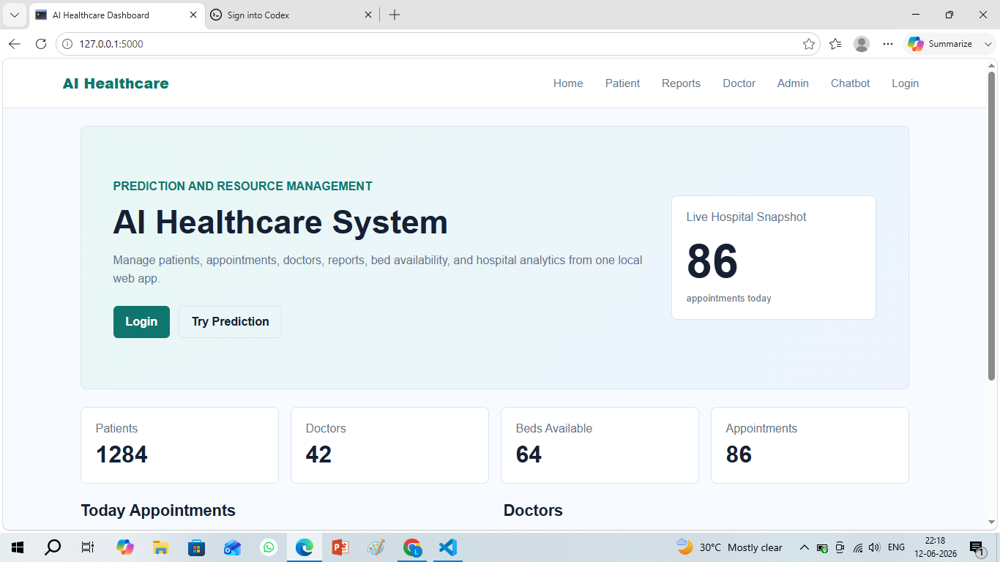
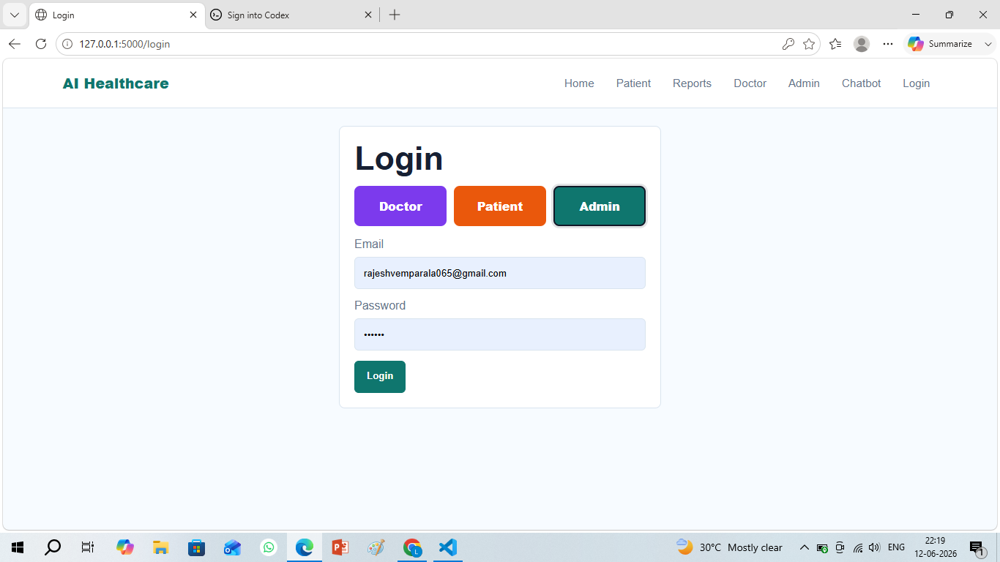
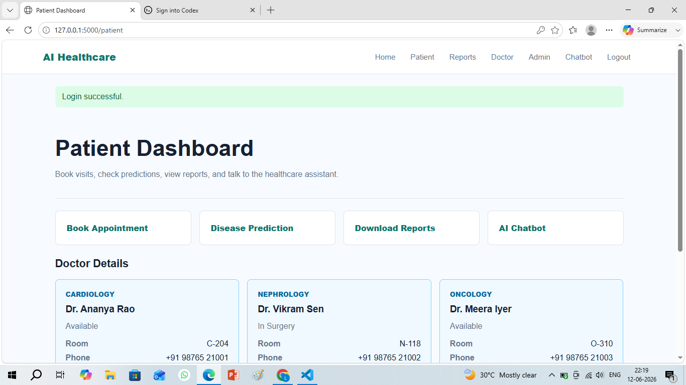

# 🏥 AI-Powered Healthcare Prediction & Resource Management System
DEMO LINK :https://ai-healthcare-system-2-2.onrender.com

## Project Overview

The AI-Powered Healthcare Prediction & Resource Management System is an intelligent healthcare platform designed to improve patient care and optimize hospital operations.

This system uses Artificial Intelligence and Machine Learning to:

* Predict diseases based on patient medical information
* Recommend treatment plans
* Forecast hospital resource requirements
* Manage appointments and Electronic Health Records (EHR)
* Analyze uploaded medical reports
* Support healthcare staff through analytics dashboards

The platform aims to improve healthcare quality while reducing operational costs and resource wastage.

## Screenshots

### Home Dashboard



### Login Page



### Patient Dashboard



# Features

## Authentication & User Management

* Patient Registration/Login
* Doctor Registration/Login
* Admin Login
* Role-Based Access Control
* Profile Management

## Patient Management

* Patient Registration
* Medical History
* Allergies Tracking
* Lab Reports Upload
* Prescription Records

## Doctor Module

* Doctor Dashboard
* Patient Records
* Treatment Recommendations
* Schedule Management

## Appointment Scheduling

* Online Appointment Booking
* Slot Availability
* Appointment Approval
* Notifications

## Electronic Health Records (EHR)

* Centralized Patient Records
* Prescription History
* Diagnostic Reports

## AI Disease Prediction

Supports prediction for:

* Diabetes
* Heart Disease
* Kidney Disease
* Cancer Risk

Algorithms:

* Random Forest
* XGBoost
* Decision Tree
* Logistic Regression

## Treatment Recommendation Engine

* AI Suggestions
* Specialist Recommendation
* Medication Guidance

## Patient Outcome Prediction

* Recovery Probability
* ICU Requirement
* Readmission Risk
* Hospital Stay Estimation

## Bed Management

* ICU Monitoring
* Bed Allocation
* Availability Tracking

## Resource Allocation

* Ventilator Monitoring
* Oxygen Units
* Equipment Forecasting

## Medical Report Analysis

* OCR-Based Extraction
* Report Alerts
* Risk Detection

## AI Chatbot Assistant

* Symptom Checking
* Appointment Support
* FAQ Assistance

## Analytics Dashboard

* Patient Trends
* Resource Usage
* Bed Occupancy
* Doctor Performance

---

# Tech Stack

## Frontend

* HTML
* CSS
* JavaScript

## Backend

* Flask
* Python

## Database

* SQLite

## Machine Learning

* Scikit-learn
* XGBoost

## AI / NLP

* LangChain
* Google Generative AI

## Visualization

* Plotly
* Matplotlib

## OCR & Image Processing

* EasyOCR
* OpenCV

---

# Project Structure

```text
AI-Healthcare-System/

├── app.py
├── requirements.txt

├── static/
│   ├── css/
│   ├── js/

├── templates/
│   ├── patient/
│   ├── doctor/
│   ├── admin/
│   └── chatbot.html

├── models/

├── uploads/
│   ├── reports/
│   ├── xrays/
│   ├── ecg/
│   └── scans/

├── datasets/

├── chatbot/

└── database/
```

---

# Installation

Clone repository:

```bash
git clone YOUR_REPOSITORY_LINK
```

Move into project:

```bash
cd AI-Healthcare-System
```

Install dependencies:

```bash
pip install -r requirements.txt
```

Run application:

```bash
python app.py
```

Open browser:

```text
http://127.0.0.1:5000
```

---

# Modules Included

✔ Authentication
✔ Patient Dashboard
✔ Doctor Dashboard
✔ Admin Dashboard
✔ Appointment System
✔ Disease Prediction
✔ Treatment Recommendation
✔ Outcome Prediction
✔ Bed Forecasting
✔ Resource Forecasting
✔ Medical Report Analysis
✔ Healthcare Chatbot

---

# Future Enhancements

* Real-Time Hospital Integration
* Cloud Deployment
* Mobile Application
* Advanced AI Diagnosis
* Medical Image Analysis
* Voice Assistant

---

# Author

Developed as a Major Project

AI-Powered Healthcare Prediction & Resource Management System

⭐ If you like this project, give it a star on GitHub.
